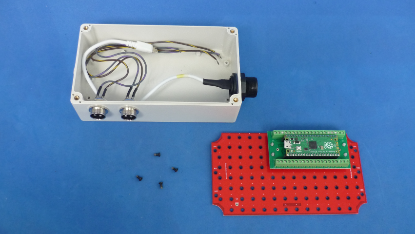

# USB FOOT SWITCH BASED ON RPI PICO

USB Foot switch based on Rpi Pico. Configurable via text file, can emulate keystrokes and combination of keys with your feet!. Apear as a USB standard keyboard. Useful for audio/video edition (start/stop), PC based DIY CNC/3D machines, you name it.

Robust and quickly materialized using [TUSISTEMITA](https://github.com/galopago/TUSISTEMITA) prototyping system.

Read this in other languages: [Español](docs/README.es.md)

## Directory structure

* The root folder contains circuit python program and config file
* utils directory contains binary files
* lib directory contains additional circuit python libraries
* docs additional files

## How to use this repository

The project is developed in CircuitPython V6.3
* Connect normally open momentary switches (buttons, pedals, levers) between required GPIO ports and ground pins.
* Plug a Micro USB to USB cable to the Rpi Pico (Don't plug into the computer yet).
* Press bootsel button and keep pressed, then plug the RPI Pico into an USB port, when plugged release bootsel button.
* RPI Pico should appear as an USB drive in your OS desktop.(named Pi RP2 Boot)
* Copy Circuit Python installer from the utils directory to the USB drive 
* Copy the contents of lib directory to the lib directory of the USB drive 
* Copy keys.conf file to the root folder of the USB drive 
* Copy code.py file to the root folder of the USB drive (overwrite)
* Unplug and Plug again
* Use it!

## Messed USB!
If for some reason you messed the code, and the usb keyboard is irresponsive or spitfiring keys, you can "format" your Rpi Pico and
start freshly again doing the following: Unplug Rpi Pico Press bootsel button and keep pressed and then plug the RPI Pico again. Copy the file
named flash_nuke.uf2 and ta-da!. Rpi Pico like new.

## License

This is an Open Source project an is licensed under a [MIT License](https://spdx.org/licenses/MIT.html)
